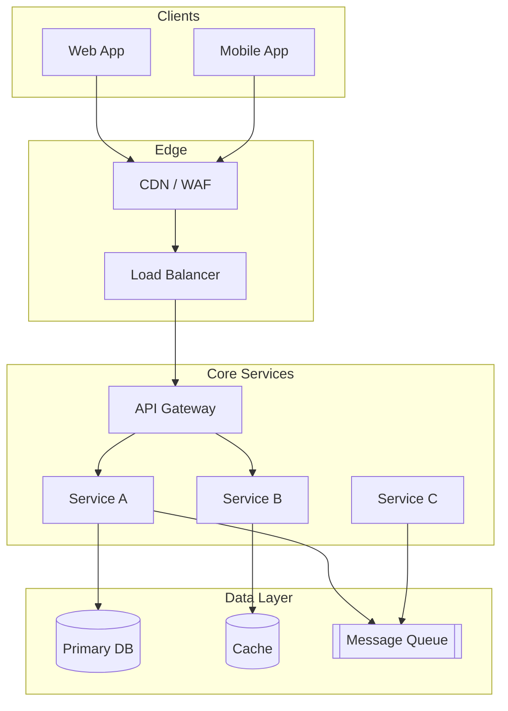
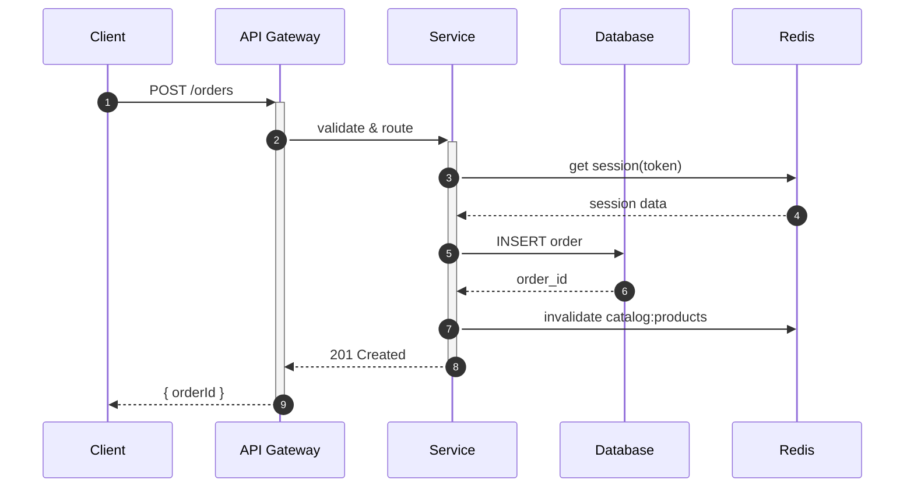
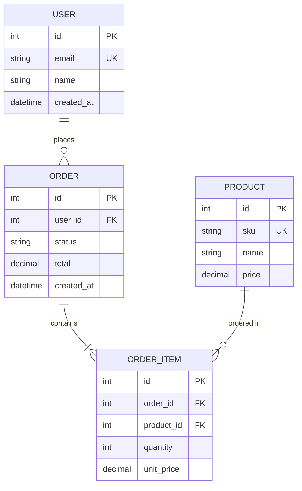
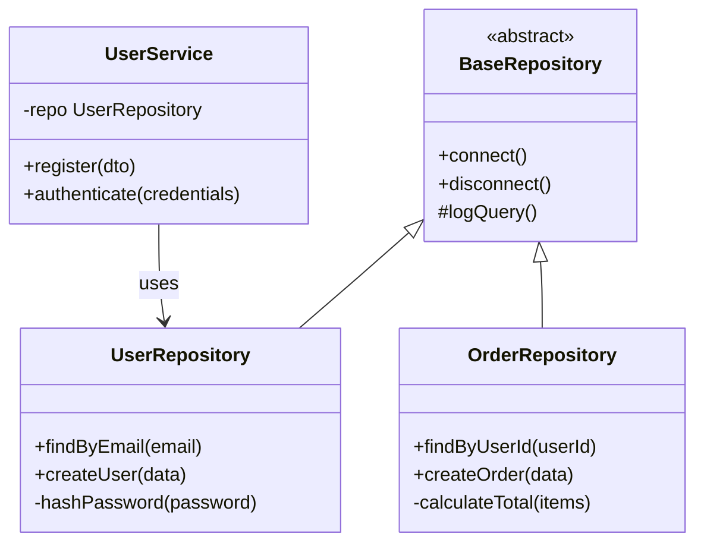
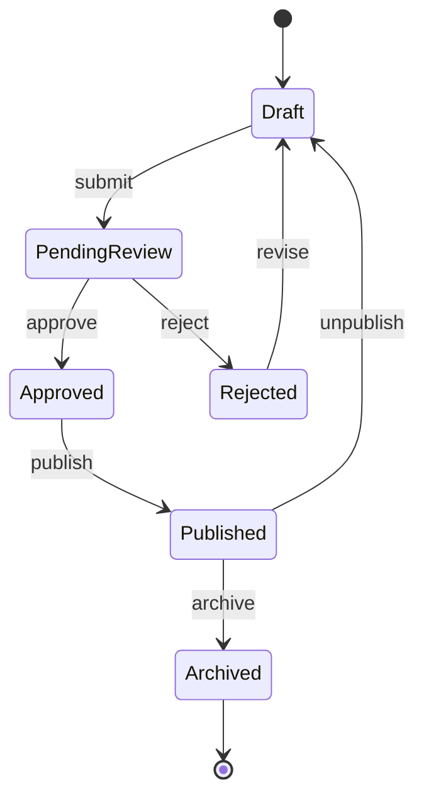
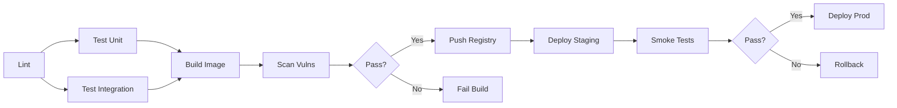
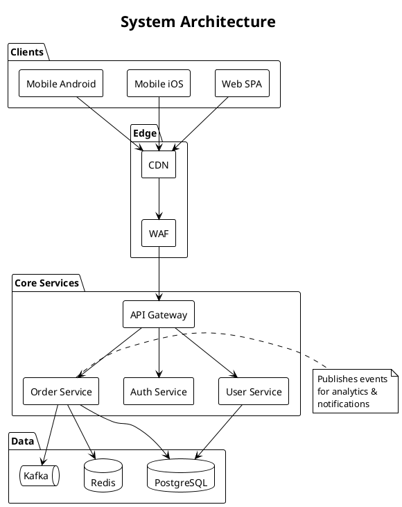
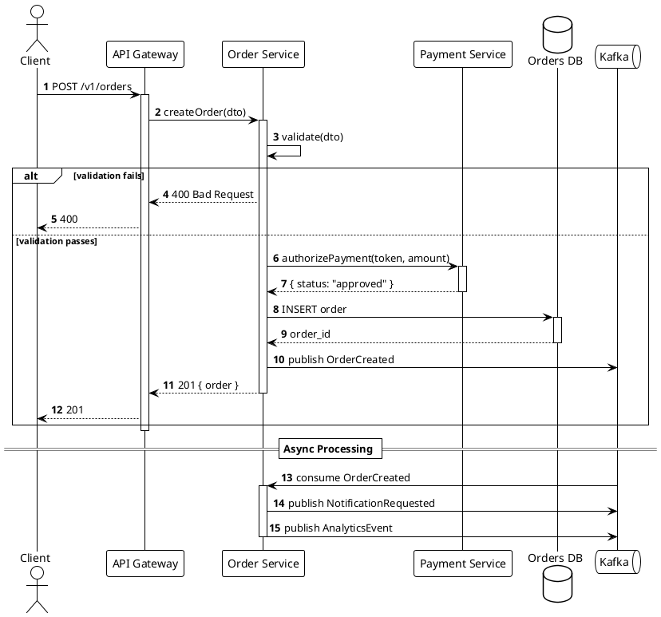
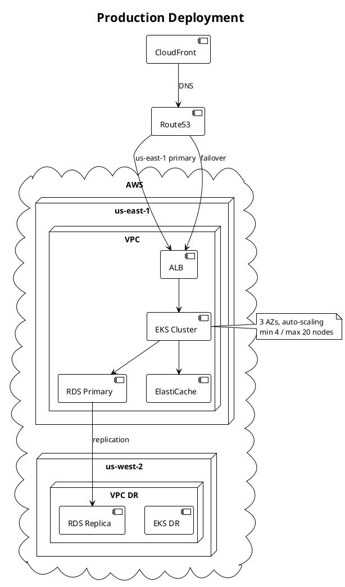
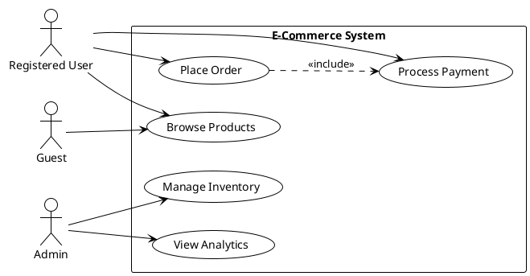

# Diagram Patterns

Reference file containing reusable Mermaid and PlantUML patterns for common software architecture documentation needs. Copy-paste as starting points and adjust node names, directions, and annotations.

---

## Mermaid Patterns

### System Architecture / Service Topology

Use for microservices, multi-tier apps, or deployment diagrams.



**Customization guide**
- Replace service names with repo or DNS names
- Add `classDef` styles to color by team or criticality:
  ```
  classDef critical fill:#ffcccc,stroke:#cc0000
  classDef data fill:#ccffcc,stroke:#006600
  class DB,Cache,Queue data
  class API critical
  ```

---

### Request Lifecycle / Sequence

Use for API call flows, auth handshakes, or transaction processing.



**Customization guide**
- Use `autonumber` for design review references
- Add `Note over X,Y: ...` for latency or error handling notes
- Use `activate`/`deactivate` (`+`/`-`) to show scope clearly

---

### Entity-Relationship / Data Model

Use for database schema documentation or domain modeling.



**Customization guide**
- Use `PK`, `FK`, `UK` annotations for key clarity
- Relationship cardinality: `||--o{`, `}|--|{`, etc.
- Group related entities with `subgraph` if Mermaid version supports it

---

### Class Hierarchy / Domain Model

Use for OOP class structures, type hierarchies, or service interfaces.



**Customization guide**
- Mark abstract classes/interfaces with `<<abstract>>` / `<<interface>>`
- Visibility: `+` public, `-` private, `#` protected, `~` package
- Add types to method signatures for richer documentation

---

### State Machine

Use for workflow status, order lifecycle, or CI pipeline stages.



**Customization guide**
- Label transitions with verb actions (`: submit`)
- Use `[*]` for start/end pseudostates
- Add `note right of StateName` for business rules per state

---

### CI/CD Pipeline (DAG)

Use for build, test, and deployment stage flows.



**Customization guide**
- Use `{Shape}` for decision gates
- Label edges for pass/fail or environment names
- Add `classDef` to color stages by environment (dev/staging/prod)

---

## PlantUML Patterns

### System Component Diagram

Use for higher-level architectural views with richer layout control.



**Customization guide**
- Use `!theme` for consistent styling (plain, cerulean, plain, etc.)
- Alias components with `as` to keep diagram text clean
- `package`, `rectangle`, `folder`, `cloud` for logical grouping

---

### Detailed Sequence Diagram

Use for complex flows requiring nested groups, references, or parallel flows.



**Customization guide**
- Use `alt/else/end`, `loop`, `par`, `critical` for control structures
- Use `== Label ==` for diagram segmentation
- `activate`/`deactivate` or automatic activation with `++`/`--`

---

### Deployment / Infrastructure Diagram

Use for documenting cloud topology, regions, and network boundaries.



**Customization guide**
- Use `cloud`, `node`, `folder`, `frame` for environment grouping
- Add network notes: latency, bandwidth, or security group references
- Use `left of`, `right of`, `over` for note placement

---

### Use Case Diagram

Use for summarizing system capabilities and actor interactions.



**Customization guide**
- `..>` for dependencies / includes / extends
- `left to right direction` improves readability for wide sets
- Alias use cases to keep diagram compact

---

## Pattern Quick-Select

| Goal | Recommended Pattern |
|------|-------------------|
| Service map / request routing | Mermaid `graph TB` or PlantUML Component |
| API call flow | Mermaid `sequenceDiagram` or PlantUML Sequence |
| Database schema | Mermaid `erDiagram` |
| OOP model / type hierarchy | Mermaid `classDiagram` or PlantUML Class |
| Workflow / status lifecycle | Mermaid `stateDiagram-v2` |
| Build & deploy pipeline | Mermaid `graph LR` DAG |
| Cloud topology | PlantUML Deployment |
| User capabilities | PlantUML Use Case |

---

## Tips for All Diagrams

- **Keep node count under 30** for single diagrams; split if needed
- **Use consistent naming**: match repo names, DNS names, or code identifiers
- **Add a title** so readers know scope without context
- **Version diagram sources**: store `.mmd` or `.puml` files in `docs/diagrams/`
- **Embed source, not just image**: allows future edits and diff tracking
- **Color with purpose**: environment (green=prod, yellow=staging), status (red=critical), or team ownership
